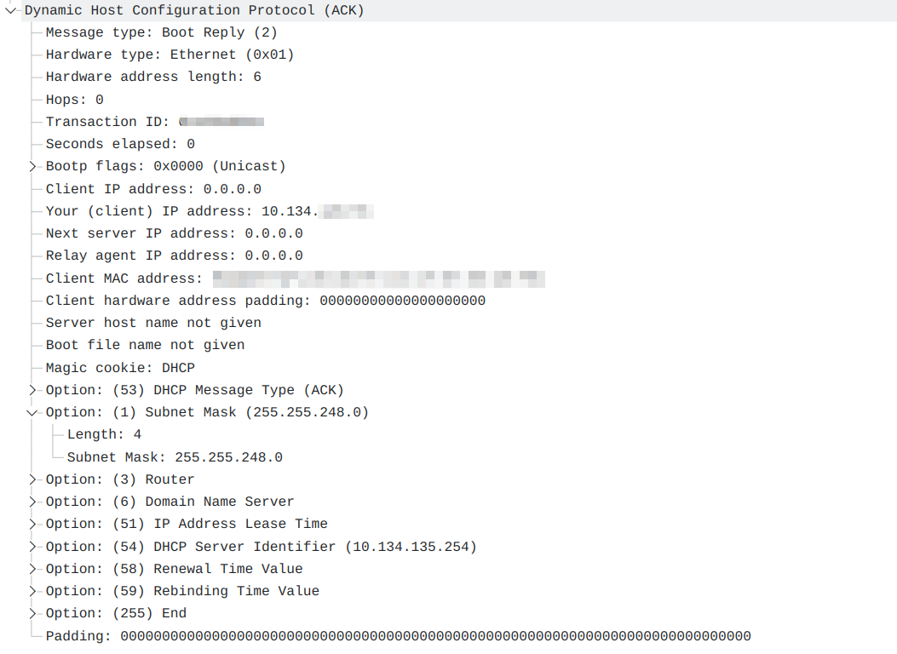
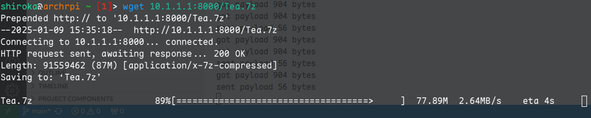

# SCU Netkazari - L2/L3 交换策略
*Version 0.1, last update: 2025/1/6*

本文记录了关于 SCU 校园网二层、三层交换策略的探查，包含一些简单的研究结果，
基本探明了它如何与认证机制配合，完成客户端数据包的管理.

## 网络行为探查

*测试环境：江安西园某舍，宿舍中配备了无线 AP 和有线网络*

**接入阶段：** 新设备接入，首先发送 DHCP Discover 包募集网络中的 DHCP 服务器，
此时会收到来自 `10.134.135.254 [58:69:6c:4c:47:53]` 的回复. DHCP 向设备分发了 IP，
子网掩码 `255.255.248.0`，以及默认网关 `10.134.135.254`.
据此，可以得知该子网 IP 地址范围为 `10.134.128.0` 到 `10.134.135.254`.
如下是抓包得到的 DHCP ACK 回复：



此时设备将获得 IP 地址，且网关也已经由 DHCP 请求知晓有新设备接入，并拿到了新设备的 MAC.

**L2/L3 交换隔离：**

*Rule 1.* 交换侧会丢弃 **任何目的 MAC 不是 `MAC_GW` 的 Ethernet 帧**，
纵使目的 MAC 地址指向了网络内一个有效的设备. 特别地，对于广播 MAC 地址，
除网关外的所有设备都不会收到广播. 也就是说：

```bash
        from MAC1 to MAC0
Source ---------------------> Gateway
MAC1           Link OK        MAC0


        from MAC1 to MAC2
Source ----------X----------> Destination
MAC1          Dropped         MAC2
```

*Rule 2.* 如果一个 IP 包的目的 MAC 是网关，网关将接受该包，并根据该包的目的 IP
地址将其转发到网络内对应的设备上（如果目的 IP 指向网络内的设备的话）. 该过程数据包的转发路径：

```bash
        from IP1 [MAC1] to IP2 [MAC0]
Source ---------------------------------> Gateway
IP1 [MAC1]                                IP0 [MAC0]
                                            |
Destination <-------------------------------'
IP2 [MAC2]    from IP1 [MAC0] to IP2 [MAC2]
```

可以看到网关将修改 Ethernet 帧的 MAC 地址，而不改变 IP 帧的地址.

*Rule 3.* 根据 *Rule 1*，ARP 广播查询请求不会被局域网中的任何设备受理，而网关这时会给出回复.
无论发送对何种 IP 地址的查询，只要 IP 地址在某个特定范围内
（目前观察到的范围是对当前子网下的所有 IP 都成立），无论这个 IP 是否被分配，网关都会给出回应.
**且回应全部指向自己的 MAC 地址.**

*Rule 4.* 根据 *Rule 2*，对于没有认证的主机，网关将拒绝转发
**来自它的流量（少数 UDP 端口得到了豁免，见下文）**，但会 **继续转发流向它的流量**.


针对以上四条规则，可总结出如下流控特征：

* 交换侧通过丢弃任何目标 MAC 地址不是网关的帧来阻止内网设备间（不经过网关）直接通信；
* 网关通过拦截 ARP 广播，并制造假的回复，引导所有主机将内网流量发送给自己
（外网流量会由每台主机的默认路由规则自然地发向网关）；
* 网关通过拒绝转发来自未认证主机的流量来阻止未认证主机联网.

## DNS Tunnel

网关在进行转发时，对 UDP 53 端口有豁免机制，这是用于 DNS 查询的端口. 本人对 UDP
50-100 内的所有端口都进行了测试，发现**有且仅有 53 端口可以得到豁免**.

具体的豁免机制为：**无论主机是否认证，网关默认放行所有目标端口为 53 的 UDP 流量，直达公网，
而不检测其源端口，也不检测 UDP 的载荷是否为有效的 DNS 数据报.**

经过实验探查，防火墙对 UDP 连接的保活时间为 5s：**自最后一个出站/入站包开始计时，若在
5s 内没有匹配端口的包入站/出站，UDP 连接会被防火墙关闭，表现为禁止新的包在该端口上继续入站.**

基于此，可以用 UDP 53 端口承载流量，然后发送到存在于公网的代理服务器，由代理服务器解析并代理流量.
虽然 UDP 是不可靠的传输，但是其中包含的协议（如 TCP）会保证传输是可靠的（如果协议需要的话）.

下面的代码可以对 UDP 53 的往返连通性进行简单测试：

```python
## Client:
import socket

SERVER_IP = 'xxx.xxx.xxx.xxx'

sock = socket.socket(socket.AF_INET, socket.SOCK_DGRAM, socket.IPPROTO_UDP)
sock.sendto('hello'.encode(), (SERVER_IP, 53))

packet, addr = sock.recvfrom(512)
print(f'recv: [{packet.decode()}] from {addr}')

```

```python
## Server (requires root privilege):
import socket

sock = socket.socket(socket.AF_INET, socket.SOCK_DGRAM, socket.IPPROTO_UDP)
sock.bind(('0.0.0.0', 53))

while True:
    packet, addr = sock.recvfrom(512)
    # Sometimes we receive packets from 127.0.0.1, just ignore them
    if addr[0] == '127.0.0.1':
        continue
    print(f'recv: [{packet.decode()}] from {addr}')
    sock.sendto('response'.encode(), addr)
```

包冗余现象：观察到，从主机发出一个包，而对方能收到两个完全一致的包，原因暂且不明.
于是在我们的协议中加入了 sequence number 机制可以避免收到重复包.

一个 DNS tunnel 的参考实现可见 [//tools/dnstunnel.py](../tools/dnstunnel.py)，
该实现利用 TUN 设备来接入内核 IP 协议栈，速度测试结果如下：


